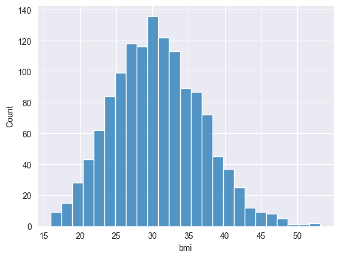

# Previsão de Custos Médicos

Este projeto tem como objetivo prever os custos médicos de pacientes com base em variáveis demográficas e comportamentais, como idade, IMC, número de filhos e tabagismo, utilizando algoritmos de regressão supervisionada.

## 1. Análise Exploratória dos Dados

### Gráfico: Boxplot de `charges` por `age` e `smoker`

```python
sb.boxplot(x='age', y='charges', data=dados, hue="smoker")
```


**Insight**: Fumantes têm custos médicos consideravelmente mais altos em todas as faixas etárias. Essa diferença é particularmente acentuada entre 40 e 60 anos.

---

### Gráficos: Histogramas e Boxplots de `age`, `bmi` e `charges`

```python
sb.histplot(data=dados, x="age")
```


```python
sb.boxplot(x=dados["age"])
```


```python
sb.histplot(data=dados, x="bmi")
```


```python
sb.boxplot(x=dados["bmi"])
```


```python
sb.histplot(data=dados, x="charges")
```


```python
sb.boxplot(x=dados["charges"])
```


**Insight**:
- Idade e IMC estão bem distribuídos, com pequenas assimetrias.
- `charges` (custos médicos) possui uma distribuição assimétrica à direita, com presença de outliers (custos muito altos).

---

### Gráfico: Violino de `charges` por `sex`

```python
px.violin(dados, y="charges", x="sex", color="sex", box=True, points="all")
```

**Insight**: Diferenças entre os sexos são pequenas em termos de custo. Não há disparidades significativas.

---

### Gráfico: Swarmplot `smoker` x `charges`

```python
sb.swarmplot(data=dados, x="smoker", y="charges")
```


**Insight**: A maioria dos custos muito altos está associada a pacientes fumantes. Essa variável é altamente preditiva.

---

### Gráfico: Heatmap da correlação

```python
sb.heatmap(data=correlation_matrix, annot=True)
```


**Insight**: As variáveis com maior correlação com `charges` são:
- `smoker` (positivo)
- `age` (positivo)
- `bmi` (moderado)

**Insight**: O hábito de fumar é o fator mais crítico nos custos médicos previstos.

---

## 2. Modelagem e Avaliação

### Modelos Avaliados

| Modelo                       | R²     | MSE          | MAE       |
|------------------------------|--------|--------------|-----------|
| Linear Regression            | 0.7312 | 35.18M       | 4,182.44  |
| Decision Tree Regressor      | 0.6519 | 45.56M       | 3,094.46  |
| Random Forest (n=120)        | 0.8312 | 22.09M       | 2,605.44  |
| KNN Regressor (k=8)          | 0.8121 | 24.59M       | 3,139.67  |

**Insight**: O modelo Random Forest obteve o melhor desempenho inicial. A regressão linear apresentou resultados instáveis com `RuntimeWarning: overflow`.

---

### Otimização com GridSearchCV

Melhor modelo:

- **RandomForestRegressor**
- Parâmetros: `n_estimators=150`, `max_depth=10`, `min_samples_leaf=10`
- **R² final**: 0.8453 (no teste)

---

## 3. Validação Estatística

```python
KFold(n_splits=6)
```

- R² por fold: `[0.8747, 0.8356, 0.8835, 0.8270, 0.8598, 0.8836]`
- **R² médio**: **0.8607**

**Insight**: O modelo demonstrou excelente robustez e generalização.

---

## 4. Importância das Variáveis

```python
feature_importance.plot(kind='bar')
```

**Importância das caracteristicas**:


1. `smoker`
2. `age`
3. `bmi`
4. `children`


**Insight**: O hábito de fumar é o fator mais crítico nos custos médicos previstos.

---

## 5. Simulações de Pacientes

```python
simulate_patient_medical_cost(...)
```

### Exemplos:
- Paciente com IMC 55: custo muito elevado.
- Fumante com mesmo perfil de um não fumante: custo até 3x maior.

**Insight**: O modelo é sensível a variáveis como IMC e tabagismo, demonstrando aplicabilidade prática.

---

## 6. Desempenho Modelo


**Insight**: O gráfico mostra uma boa aderência entre os valores previstos e os valores reais, com a maioria dos pontos concentrados ao longo da linha de referência (em vermelho tracejado)

## Conclusão

- A Random Forest ajustada apresenta o melhor equilíbrio entre precisão e robustez.
- Tabagismo, idade e IMC são os fatores mais relevantes.
- A aplicação do modelo permite prever custos com alta confiabilidade, sendo útil para seguradoras e planejamento de saúde pública.
